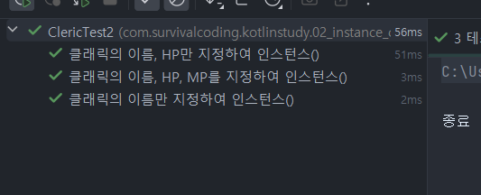

# Kotlin 기초 정리 – 클래스

---

## 클래스 기본 개념

- **프리미티브 타입** → 값 자체를 저장
- **레퍼런스 타입** → 주소를 저장

> Kotlin에서는 **모든 타입이 레퍼런스 타입**이다.

---

## 메모리 구조

메모리는 여러 구역으로 나뉘며, 각 구역의 역할이 다르다.

| 영역    | 설명        |
|-------|-----------|
| HEAP  | 동적 할당 메모리 |
| STACK | 지역 변수 저장  |

> - 인스턴스는 **런타임 시 힙(Heap) 영역**에 생성된다.
> - 자바 계열 언어는 **객체의 주소값을 직접 볼 수 없다.**

---

## 생성자

- 클래스에 **생성자 정의가 하나도 없을 경우**,  
  → 컴파일러가 “인수 없음, 리턴 없음”의 **기본 생성자**가 있다고 본다.
- 기본 생성자만 있는 클래스:
  ```kotlin
  class Person
  ```
  ```kotlin
  var person = Person()
  ``` 

---

## Companion Object

- Java의 `static`과 비슷한 개념.
- **Top-level의 `const val`** 과 비슷한 효과를 가진다.
- 클래스가 아닌 **클래스 자체에 속한 정적 데이터**를 정의할 때 사용.
- 인스턴스는 **동적 데이터**, Companion Object는 **정적 데이터**.

```kotlin
class Hero(
    var name: String,
    var hp: Int,
    var sword: Sword? = null
) {
    companion object {
        var MONEY = 100

        fun setRandomMoney() {
            MONEY = Random.nextInt(1000)
        }
    }
}
```

- Companion Object 안에 **함수**를 넣으면 **정적 함수**가 된다.
- `setRandomMoney()`는 `Hero`클래스에 **속한** 정적 함수이다.
- `Hero.setRandomMoney()`로 호출할 수 있다.

---

### ❓ Companion Object 안에서 인스턴스 멤버 접근방법

- Companion Object는 **정적 메모리**에 있으므로,  
  클래스의 인스턴스 멤버(`name`, `hp` 등)에 직접 접근할 수 없다.
- 접근하려면 Companion Object안에서 **새 인스턴스를 생성**해야 한다.
  ```kotlin
  val hero = Hero("슈퍼맨", 100)
  println(hero.name)
  ```

---

## 테스트 기초

### 테스트 종류

| 구분                    | 설명                         |
|-----------------------|----------------------------|
| **수동 테스트**            | 사람이 직접 확인 (예: `println()`) |
| **단위 테스트(Unit Test)** | 하나의 함수나 메서드만 테스트           |
| **통합 테스트**            | 여러 클래스나 함수의 연동 테스트         |

---

## 테스트 방법론

- **화이트박스 테스트**: 코드 내부 로직 중심으로 테스트
- **블랙박스 테스트**: 입력과 출력만 보고 테스트

## 테스트 기법

- **경계값 분석(Boundary Value Analysis)**
    - 예: 1~120 범위라면 `0, 1, 2, 119, 120, 121`을 테스트
- **동등분할(Equivalence Partitioning)**
    - 입력값을 여러 구간으로 나누어 각 구간 대표값 테스트

---

## TDD (Test Driven Development)

> **테스트 중심 개발 방법론**

- “테스트를 먼저 작성하고, 테스트가 통과하도록 코드를 수정”
- 테스트를 반복하면서 기능을 개발

---

## 📘 지켜가야 할 코딩 원칙

- 코딩을 하면서 **의문점과 해결방법을 함께 기록**하자.
- Kotlin은 **버전업이 자주 일어나며 새로운 기능이 추가**되므로, **공식 릴리즈 노트를 주기적으로 확인**하는 습관을 들이자.
- 같은 숫자를 여러 곳에서 수정해야 한다면, **공통 상수(const val)** 로 정의해 한 번만 수정되게 한다.
  → **매직 넘버 제거**
- 협업 시 중요하므로 **코드 정리**를 습관화하자.
    - 단축키: `Ctrl + Alt + L` (코드 자동 포맷팅)
    - 의미 있는 **주석 작성**으로 코드의 의도를 명확히 남기자.

---

## 과제 리뷰

> ## Cleric 클래스에 관하여, 2가지 수정을 하시오
>
> ---
>
> 1️⃣ 현시점의 Cleric 클래스의 정의에는, 각 인스턴스별로 최대 HP와 최대 MP 필드에 대한 정보를 가지고 있다.
> 하지만, 모든 성직자의 최대 HP 는 50, 최대 MP 는 10으로 정해져 있어,  
> 각 인스턴스가 각각의 정보를 가지는 것은 메모리 낭비이다.  
> 그래서, 최대 HP, 최대 MP의 필드가 공유 되도록 필드 선언에 적절한 키워드를 추가하시오.
>
> ---
>
> 2️⃣ 아래의 방침에 따라, 생성자를 추가하시오
>
> **A)** 이 클래스는 `Cleric("아서스", hp = 40, mp = 5)` 와 같이,  
> 이름, HP, MP 를 지정하여 인스턴스화 할 수 있다.
>
> **B)** 이 클래스는 `Cleric("아서스", hp = 35)` 와 같이,  
> 이름과 HP만으로 지정하여 인스턴스화 할 수 있다.  
> 이 때, MP는 최대 MP와 같은 값이 초기화 된다.
>
> **C)** 이 클래스는 `Cleric("아서스")` 와 같이 이름만을 지정하여 인스턴스화 할 수 있다.  
> 이 때, HP 와 MP 는 최대 HP와 최대 MP로 초기화 된다.
>
> **D)** 이 클래스는 `Cleric()` 과 같이 이름을 지정하지 않는 경우에는 인스턴스화 할 수 없다고 한다.  
> (이름이 없는 성직자는 존재 할 수 없음)

---

## 1번

```kotlin
class Cleric(
    var name: String,
    var hp: Int = MAX_HP,
    val maxHp: Int = MAX_HP,
    var mp: Int = MAX_MP,
    val maxMp: Int = MAX_MP,
) {
    companion object {
        const val MAX_HP = 50   // 최대체력
        const val MAX_MP = 10   // 최대마나
        const val AID_COST = 5  // selfAid() 사용마나
    }
}
```

- companion object를 활용하여 공유자원을 생성한다.

---

## 2번



---

## 리팩토링

```kotlin
class Cleric(
    var name: String,
    var hp: Int = MAX_HP,
    val maxHp: Int = MAX_HP,
    var mp: Int = MAX_MP,
    val maxMp: Int = MAX_MP,
)
```

- 기존의 매직 넘버 제거

```kotlin
fun selfAid() {
    if (mp < AID_COST) {
        return
    }

    mp -= AID_COST
    hp = maxHp
}
```

- 매직 넘버를 제거하고, `Early Return Pattern`으로 가독성을 향상

```kotlin
fun pray(time: Int): Int {
    val mpRecovery = time + Random.nextInt(0, 3)
    var actualRecovery: Int

    if ((mp + mpRecovery) < maxMp) {
        actualRecovery = mpRecovery
        mp += mpRecovery
    } else {
        actualRecovery = maxMp - mp
        mp = maxMp
    }

    return actualRecovery
}
```

- **return**을 2개에서 1개로 변경
- 좀 더 흐름을 명확하게 변경