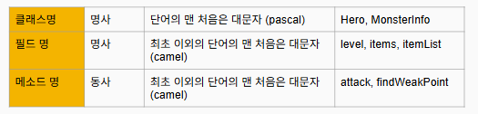

# 인스턴스와 클래스
## 1. 오브젝트를 도출하는 순서
- 각 오브젝트가 가지고 있을만한 "속성"이나 "동작"을 생각해 종류와 내용을 정의
- 각 오브젝트를 가상세계에 도출,동작 시켜보기

### *용어 정리
- 오브젝트 ( object ): 현실 세계의 모든 객체 ( =인스턴스 )
- 클래스 ( class ): 오브젝트를 가상세계 용으로 구체화 한 것 (붕어빵 틀)
- 인스턴스 ( instance ): 클래스를 활용해 메모리 상에 만들어 낸 것 ( 붕어빵 )

### 1-1 ) Hero를 클래스 코드로 표현하기
```kotlin
class Hero(name: String, hp: Int) {
    fun attack() {}
    fun run() {}
    fun sleep() {}
}
```
### 1-2 ) 필드를 상수로서 선언
슬라임이라는 클래스를 만든다고 했을 때 레벨이 필요하다.
```kotlin
class Slime(hp: Int) {  
    val level = 10
}
```

## 2. 클래스와 멤버변수의 네이밍 컨벤션


## 3. 함수와 메서드
- 함수: 인풋이 같으면 아웃풋이 동일한 것. ( 순수한 함수 )
- 메서드: 클래스 안에 선언한 함수의 형태. 클래스의 동작을 위해 만들어졌다. 즉 클래스의 상태를 변경하기 위한 함수다.


## 4. 클래스 정의에 따른 효과
- 정의한 클래스로 인스턴스를 생성할 수 있다.
- 이 클래스로 생성한 인스턴스를 넣을 수 있는 새로운 변수의 타입이 이용이 가능해진다.
ex) Hero 클래스를 정의하면 Hero 타입의 변수가 이용가능
```kotlin
fun main() {
    val hero = Hero(name = "홍길동", hp = 100)
    println("${hero.name}의 체력은 ${hero.hp}입니다.")
}

class Hero(var name: String = "", var hp: Int = 0) {
}
```

## 총 정리
- 인스턴스와 클래스
  - 인스턴스와 클래스는 완전히 다른 것이다. 혼동하지 말자
  - 가상 세계에서 활동하는 것은 인스턴스 (오브젝트)
  - 인스턴스를 생성하기 위한 틀이 클래스


- 필드와 메소드 
  - 클래스에는 속성을 필드로, 동작을 메소드로 선언한다 
  - val 이 붙은 필드는 상수 필드로서 값이 불변이다

- 클래스 타입 
  - 클래스를 정의하면, 그 클래스 타입의 변수를 선언 할 수 있다
  - 어떤 클래스 타입 변수는 그 클래스의 인스턴스를 담을 수 있다

- 인스턴스화 
  - 어떤 클래스 타입 변수에 인스턴스가 담겨 있을 때 “변수명.필드명" 이나 “변수명.메소드명()” 으로
  그 인스턴스의 필드나 메소드를 이용할 수 있다
