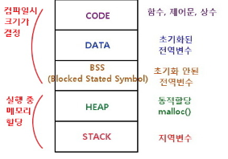

# 클래스

## 1. 레퍼런스 타입과 참조

 
1. 우리가 만든 인스턴스를 생성하면 가상세계에 올라간다 = 메모리에 올라간다.
2. 메모리 안에 있는 heap에 보통 올라감
3. 메모리 안에 구역들이 다 나뉘어져 있다.

```kotlin
val hero = Hero(name = "용사", hp = 100)
```
- Hero 클래스를 인스턴스화 (= hero 에 Hero의 주소를 담는다. )

```kotlin
val hero = Hero(name = "용사", hp = 100)
val hero2 = hero1
hero2.hp = 200
```
 - hero1 주솟값과 hero2 의 주솟값이 같다. 
 - 인스턴스는 하나 ( new 가 몇개인가? 1개 )

----------

## 2. 코틀린에서는 모든 타입이 레퍼런스 타입
- Int 형이나 Double 형 같은 기본형 (primitive type) 뿐만 아니라 String도
Hero 와 같은 “레퍼런스 타입" 이다.

----------

## 3. 생성자
- Hero를 생성하는 방법
```kotlin
//Kotlin 은 기본값을 지정하는 것으로 생성자 오버로딩을 지원한다
class Hero(
  var name: String,
  var hp: Int,
  var sword: Sword? = null,
){}

// 1. 무기 없이 생성 
val hero1 = Hero(name = "슈퍼맨", hp = 100)

// 2. 전부 다 생성
val sword = Sword(name = "불꽃의 검", damage = 5)
val hero2 = Hero(name = "배트맨", hp = 100, sword = sword)
```

----------

## 4. 정적 멤버
    companion object 를 사용해 공유 자원으로 취급한다.
 - Java 의 static 같은 존재
 - 보통 클래스 맨 아래에 작성한다.
 - 탑레벨로 대체 가능 ( 역할에 따라 )