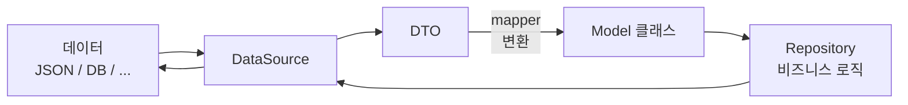

# DTO, Mapper
1. [코드 리뷰](#-코드-리뷰)
2. [DTO](#dto-data-transfer-object)
    - [클라이언트에서 DTO가 필요한 이유](#dto가-필요한-이유-클라이언트에서)
    - [DTO 만드는 방법](#dto-만드는-방법)
3. [Mapper](#mapper)
    - [Mapper 만드는 방법](#mapper-만드는--방법)
    - [Mapper 작성시 extenstion을 선호하는 이유](#mapper-작성시-extenstion확장함수를-선호하는-이유)
    - [결론적으로 DTO을 왜 쓰는가...](#결론적으로-dto를-왜-쓰는가)

## 📌 코드 리뷰

- 클래스/인터페이스가 없는 코틀린 파일은 소문자로 시작해도 됨

```kotlin
// setBody(patchBody)에서 자동으로 직렬화 되도록 하려면 설정이 필요함
// 의존성 추가도 필요함
HttpClient(CIO) {
    install(ContentNegotiation) { json() }
}
```

```kotlin
val response = client.patch("https://jsonplaceholder.typicode.com/posts/$id"){
    contentType(ContentType.Application.Json)   // 서버에 전송할 콘텐츠 설정
    setBody(patchBody)    // 부분 업데이트할 객체를 JSON으로 직렬화하여 본문에 포함
}
```

- `Response` 의 body는 비어있을 수 있다
    - <T?> 로 nullable로 처리하던지
    - Unit으로 빈 것으로 처리하던지

- 상수로 `BASE_URL` 값 정해두고, 파라미터나 이런 것만 조정해주면 좋음
    - 테스트도 편함

- `saveImages()` 를 병렬로 처리하면 성능도 챙길 수 있음

- `MocKEngine`
    - 처음엔 편한줄 몰랐다가
    - 이게 편한거였다를 알게된다

- `HttpHeaders.ContentType` 이랑 `ContentType.Application.Json` 처럼 주어진 것 쓰는게  
  문자열 쓰는 것보다 휴먼 에러 걱정이 적고 좋다


- `Response<T>` 실패했을 때의 타입을 따로 만들어줄수도 있다
    - **DataSource에서 `Response<T>` 를 반환해야지 테스트에서 상태 코드를 확인할 수 있다**

```kotlin
HttpClient(CIO) {
    install(ContentNegotiation) {
        json(Json {
		        // 예외를 던지는 대신 JSON에서 알 수 없는 속성이 발견되면 무시
            ignoreUnknownKeys = true
            // 따옴표 없는 JSON 키와 문자열 값이 허용됨
            isLenient = true
        }) 
    }
}
```

- 빈 JSON 객체가 반환되었을 때, 역직렬화 기준을 관대하게 설정가능
    - https://ktor.io/docs/client-serialization.html#register_xml
- **JsonBuilder의 Properties**

  https://kotlinlang.org/api/kotlinx.serialization/kotlinx-serialization-json/kotlinx.serialization.json/-json-builder/

    - ContentNegotiation으로 직렬화 설정할 때, `json` 생성자에 `JsonBuilder` API에 접근할 수 있다
    -

- 일부 프레임워크에서는 Unit test에서 실제 통신을 하지 못하도록 한다


- `withContext(Dispatchers.IO)` 쓰는게 좋다
    - DataSource 쪽의 실제 통신하는 부분은 다 써주는게 좋겠다
    - bodyAsBytes나 writeBytes 같이 I/O 해주는 부분…

### 의문점 해결

1. `DataSource` 의 메서드의 반환형  
   ➡️ `Response<T>`  
   테스트에서 상태코드 / 헤더 등을 테스트하기 위해

2. 응답으로 온 상태 코드는 어디에서 처리하는가?  
   ➡️ `DataSource`


---

# DTO, Mapper
> 🥝 **Model Class**  
> 앱에서 사용되는 **데이터 구조(User)**
>
> 🥝 **Data Source**  
> 원천 데이터(JSON/DB/API)를 읽고 → **Model로 변환하는 계층**
>
> 🥝 **Repository**  
> Data Source를 이용해 → 데이터를 **필터링/정제/가공하여 제공하는 계층**

> 기존에 작성한 모델 클래스는 DTO와 모델 클래스의 역할을 모두 가지는 클래스였음 → 역할 분담  
🥝 **DTO** : 데이터 소스(원천 데이터) 직렬화, 역직렬화  
🥝 **Model Class** : DTO에서 필요한 내용만 활용하는 도메인 객체




## DTO (Data Transfer Object)

> 불안한 데이터를 바로 모델 클래스로 만들지 않고, 순수한 값을 저장하는 중간 매체를 이용하는 것
(중간매체 = DTO)
>
>잘못된 원천 데이터를 받더라도 안터지게 하려는 클라이언트 개발자의 최후의 방어 수단


### **DTO가 필요한 이유 (클라이언트에서)**

- 데이터소스를 모델로 정의하기 어려운 경우
    - 동적 JSON — 속성명(도메인)이 다를 때
- 서버에서 잘못된 값을 보내는 경우
    - `“id”: “1”` 이렇게도 보내고, `“id”: 2` 이렇게도 보내는 경우
    - 서버한테 뭐라고 못함… 내가 `Any?` 같은걸로 받아서 런타임에 타입 확인해야 함 — 위험

### DTO 만드는 방법

> Json이 아무리 이상해도 안 터지고 받아들이게 작성
>

```kotlin
@Serializable
data class TodoDTO(
		val userId: Int? = null,
		val id: Int? = null,
		val title: String? = null,
		val completed: Boolean? = null,
)
```

1. 모든 필드 Nullable로 하고 직렬화되게
2. Json을 받아들이기 편한 플러그인 사용

## Mapper

> 순수한 데이터 소스(DTO)를 원하는 모델 클래스로 변환하기 위한 로직 (유틸 메서드)

- DTO를 모델로 변경했을 때의 장점
    - Boolean 필드는 is 접두어 사용 가능 (코틀린 컨벤션)
    - Nullable (`?`) 타입 제거로 안전성 향상

      (Nullalble ⇒ non-Nullable 널 안정성)

    - 도메인 모델은 순수 코틀린 타입 사용
      (LocalDate 같은거 사용 가능)


- ➕ model class는 데이터와 상관없이 UI를 보고 미리 정의 가능함
    - model ⇒ repository에서 사용
    - DTO ⇒ data source에서 사용
    - 즉, 데이터의 형식을 몰라도 model를 만들고 repository 정의하는 것이 가능함

### Mapper 만드는  방법

```kotlin
fun PostDTO.toModel(): Post {
		return Post(
				id = id ?: 0,
				title = title ?: "제목없음",
				contents = body ?: "",
}
```

1. 확장함수 활용 추천
2. 필요한 로직
    - Nullable을 non-Nullable로 변환하는 것이 핵심 — 사용하기 편하도록
    - DTO 전체를 model로 변환하는 것이 아님. 일부 필요한 부분만 변환하는 것

- model의 필드에 Nullable이 없는건 아니지만, non-Nullable로 하는게 쓰기 편함
- DTO의 모든 속성을 사용할 필요가 없음
    - 필요한 것만 사용하기 편한 형태로 model로 변환하면 됨
    - 명세서에 없어도 존재하는 속성이 있을 수 있음 — DTO는 모든걸 받아와야 함


- ➕ 서버 API도 버전관리를 함

### Mapper 작성시 extenstion(확장함수)를 선호하는 이유

> DTO를 직접 수정하지 않고도, DTO에 기능을 붙인 것처럼 만들 수 있으며  
> 매핑 로직을 별도 파일로 완전히 분리할 수 있기 때문
>
- DTO는 자동으로 만들고 수정 X (무지성으로 만들기, 다른 코드 개입 금지, 실수 방지)
- mapper는 복잡한 로직이 포함될 수 있어서 인간이 작성, 문제 있으면 여기만 살핀다
    - DTO는 순수한 데이터 소스이므로, DataSource → Repository에서 터진다면
      mapper 밖에 문제될 곳이 없음
- DTO와 mapper 코드를 분리


- ➕ 나중에 원천 데이터가 바뀌어도, DTO와 Mapper만 수정해주면 됨

- DataSource에서
    - DTO / JSON 뭘 넘길거냐 — DTO 넘기면 Mapper가 간단해지고, 아니면 복잡해짐 (선택해야)
    - DTO / Response<T> 뭘 넘길거냐? — Response 객체를 넘기는게 맞는 것 같다

### 결론적으로 DTO를 왜 쓰는가…

- Model Class는 non-Nullalbe 값만 가지고 있도록 하기 위해서
- Json 데이터에 null 값이 포함될 수 있음 (명세서에 명시되어 있지 않더라도…)
- Map → Model Class 변환시 null 값 등의 예외를 사전에 걸러내기 용이함
- 불완전한 코드가 포함될 것 같다면 DTO를 도입하자
- Json 값에 예외가 없다면 반드시 DTO를 도입할 필요는 없다 (데이터의 신뢰도가 높을 경우)