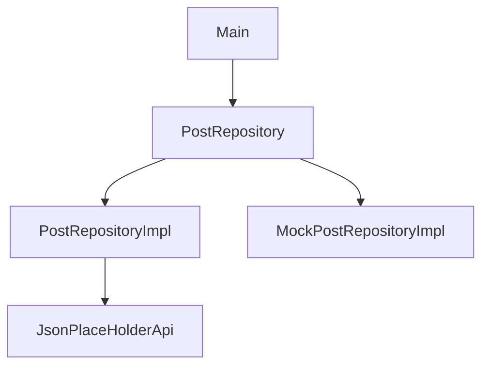

# Model, Repository / 테스트 이론
1. [코드 리뷰](#-코드-리뷰)
2. [Model, Repository](#model-repository)
   - [데이터의 흐름 이해하기](#데이터의-흐름-이해하기)
   - [Model Class](#model-class)
   - [Repository 패턴](#repository-패턴)
3. [Test 이론](#test-이론)
    - [Test Double](#test-double)

## 📌 코드 리뷰

- `File` 객체를 생성해서 읽어와서 적절한 객체로 역직렬화하는 함수를 만들고 싶었는데
    - 희표님 코드에서 제네릭을 활용하신 것을 보고, 제네릭을 사용했으면 됐을거라는 생각을 하였다

    ```kotlin
    interface Deserialization {
        fun <T> jsonFileToClass(path: String): T
    }
    
    class TodoDataSourceImpl : TodoDataSource, Deserialization {
    		override fun jsonFileToClass(path: String): T {
    				val file = File(path)
    		    val json = file.readText()
    
    		    return Json.decodeFromString<T>(json)
    		}
    }
    ```


- scope 함수 — 모든 객체에 존재
    - apply 함수

- `user` 함수 — `Closeable` , `AutoCloseable` 을 구현한 객체(구현체)에서 사용 간능
    - try-catch 구문이 있어서 자동으로 닫아줌

- List 확장함수
    - `drop()` : List에서 몇번째 줄까지 제거하겠다
    - `zip()` : Pair 객체로 변환
    - `toMap()` : Map으로 변환

- Map 확장함수
    - `getOrDefault(key, 디폴트값)` : key의 value가 없으면 디폴트값을 가져오겠다?

- generated data class file
    - json to kotlin class 라이브러리

- StockListing() 생성자의 파라미터만 넣으면 순서 바뀌면 안되니까

  파라미터명도 써줬으면 더 방어적인 코드가 되었을 것

    - 생성자로 List에 add하는 것보다는 함수형으로 넘기는 것이 더 좋아보인다? 어떻게?

      map{}이나 이런거 써서


- `inline` 함수와 함께 사용하는 `<reified T>`
    - 컴파일 시점에 어떤 타입인지 런타임에 알 수 있게하는 문법

- 어떤 메서드에서 특정 경로나 특정 개체를 생성한다면,
  해당 객체는 경로나 객체에 의존성을 가지는 것이다
    - 생성자의 파라미터로 경로를 받으면, 특정 경로에 의존성 없이 사용할 수 있다

- toLocalDate와 toNullOrDate 는 순수함수라서 Util로 따로 빼는게 좋을 것 같다

- override suspend fun getStockListings(): List<StockListing> `= withContext(Dispatcher.IO)` { }
    - 나중에 이 함수를 사용하는 곳에서, IO 디스패처를 사용하도록 설정할 수 있다

---

## Model, Repository

### 데이터의 흐름 이해하기

> ✔️ **Model Class**  
> 앱에서 사용되는 **데이터 구조**(ex. User)
>
> ✔️ **Data Source**  
> 원천 데이터(JSON/DB/API)를 읽고 → **Model로 변환하는 계층**
>
> ✔️ **Repository**
> Data Source를 이용해 → 데이터를 **필터링/정제/가공하여 제공하는 계층**


> 정리하기 전까지 이해한 흐름  
> 
> 예를 들어, 로컬 json 파일에 원천 데이터가 있다고 가정하자.  
    1. 데이터 소스 구현체는 json 파일을 입력받고 내용을 역직렬화해서 User 객체로 반환한다  
    2. 여기서 데이터 소스가 다루는 User 객체는 model class다  
    3. repository 구현체는 데이터소스를 생성자로 받아서, 내부적으로 입력된 User 객체중에 필요한 것을 정제하여 이후 사용에 편리하게 만든다.

> **Data Source & Repository:** 데이터를 나르고 처리하는 **일꾼(로직, 행위)**
> **Model Class:** 일꾼들이 나르고 있는 **상자(내용물, 상태)** — 즉, 데이터 그 자체를 의미


- Model Class / Data Source / Repository 개념 정리
    - **Model Class = 앱 안에서 사용되는 데이터 구조(객체)**
        - 보통 `data class User(val id: Int, val name: String)` 같은 형태
        - “도메인 모델(Domain Model)”이라고도 불림
        - 앱에서 User를 표현할 때 **항상 같은 형태**를 유지하게 해줌

      즉, 데이터가 어디서 오든(User JSON, DB, API)… 앱에서는 결국 User라는 같은 모델을 쓴다

    - **Data Source = 데이터를 실제로 가져오는 곳**
        - 원천(raw) 데이터를 읽기
        - 역직렬화/변환(Parsing)
        - Model 형태로 반환

      데이터소스는 로컬 파일이나 DB에서 데이터를 읽어와 객체로 만든다

    - **Repository = 데이터 소스들을 조합하고, 필요한 데이터만 골라 정제하는 계층**
        - 여러 DataSource 를 감싸는 Wrapper 역할
        - 데이터 합성, 필터링, 캐싱, 비즈니스 로직 일부 담당

      Repository는 앱에서 필요한 데이터가 무엇인지 알고, DataSource를 적절히 호출하고 가공하여 최종 결과를 제공한다


---

### Model Class

> 결론적으로, `data class` 의 모든 필드를 `val` 로 해주면 됨

**Model Class의 책임과 역할**

- **모델 객체 클래스의 속성에 대한 데이터를 조회할 수 있는 클래스 (=데이터를 담는 클래스)**
    - 별도의 기능을 가지지 않는 순수한 클래스
    - 데이터소스로부터 받은 데이터를 앱에서 필요한 행태로 변환하여 앱에서 필요한 형태로 변환하여 앱 개발을 편리하게 해주는 역할

- model class로 주로 `data class` 사용할 것이다
    - View에 보여질 데이터를 담는 객체 (보기 좋게 담아 둘것이다)
    - 다 `val` 로 해서 setter 제공안하고 수정 불가능하게 — 불변 (안전하니까)
    - 클라이언트 개발자가 json 파일같은거 없이 기획서만 보고 미리 만들어둘 수 있어서, 실제 속성명과는 다를 수 있음

- model class (아래는 비슷한 용어들)
    - 도메인 모델
    - Entity
    - DTO (Data Transfer Object, Json 데이터 같은 것을 순수하게 담는 객체)
    - POJO (Plain Old Java Object, 순수 자바 객체)
    - VO (Value Object, 값을 저장하는 객체)
    - 데이터 클래스 (4종 세트; equals(), hashCode(), toString(), copy())

**모델링 방법**

- **DDD (Domain Driven Design)**
    - 도메인 중심으로 설계
    - Domain: 유사한 업무의 집합 (특정 상황이나 특정 객체가 중심이 될 수 있음)
- ORM (Object-relational mapping)
    - 데이터 소스가 DB인 경우, DB와 모델 간 상호 변환을 도와주는 기법

### Repository 패턴

> 메인에서 DataSource를 가지고 와서 처리해도 되지만,  
복잡하니까 Repository를 통해서 접근할 수 있도록 하겠다!


- 정의:
    - 소프트웨어 개발에서 데이터 저장소에 접근하는 객체를 추상화하고,

  데이터소스(DB, File 등)과의 통신을 담당하는 객체를 캡슐화하는 디자인 패턴

    - 메인에서 DataSource를 직접 사용하지 못하도록 캡슐화 하겠다

- 책임과 역할:
    - 데이터 접근에 대한 추상화 계층
        - 데이터 접근의 진입점
        - 데이터 소스 은닉
        - 비지니스 로직과 데이터 소스 사이의 중재자
    - 데이터 매핑, 변환 담당

#### Repository 패턴의 이점

- 데이터 접근 추상화
    - 데이터 소스 구현 세부사항 은닉
    - 일관된 인터페이스 제공
- 유지보수성 향상
    - 관심사 분리
    - 코드 재사용성
- 테스트 용이성
    - 데이서 소스 mocking 가능
    - 단위 테스트 작성 용이
- 확장성
    - 새로운 데이터 소스 추가 용이
    - 기존 코드 수정 최소화
    - 인터페이스 기반 설계

- 데이터 소스를 모킹한다 <<< 중요 포인트
    - 예를 들어, 단무지 여부가 어떤 차이가 있는지 볼 때 생성자에 필요한 가짜 당근을 넣을 수 있도록

#### 데이터 소스 VS Repository

- **데이터 소스**: 데이터를 읽고 쓰는 구체적인 메커니즘에 집중 — 저장 매체와 직접적인 소통

  (용도에 맞는 저장매체 특화 로직 구현)

    - File을 조작하거나
    - 서버와 통신하거나
    - 메모리를 사용하거나
    - (옵션) 데이터 형식을 변환할 수도 있음
- **Repository**: 어떤 데이터를 앱에 제공할 것인가에 집중
    - 데이터 소스를 숨기고 상위 계층에서 일관된 방법으로  데이터에 접근하는 방식을 제공
    - 데이터를 비즈니스 로직에 전달
    - 도메인 특화 기능을 제공
        - 도메인 의도가 명확히 드러남
        - 재사용 가능한 쿼리 로직
        - 데이터 소스 구현과 분리된 비즈니스 요구사항 처리

---

## Test 이론

> 어떻게 하면 테스트를 더 잘 할 수 있을까?

- 불확실성을 없애기
    - 인터페이스를 만들어 놓고 구현체로…

### Test Double

> 테스트를 진행하기 어려운 경우에 테스트가 가능하도록 만들어주는 객체

- 모호한 경계를 가지므로 용어에 집착하지 말자

- **Mock 객체**
    - 가짜 데이터
    - 서버와 통신할 경우를 테스트할 때, 가짜 서버를 만들어서 테스트
    - 써야하는 이유:

      Unit test에서 live web service나 DB에서 데이터를 가져오는 클래스에 의존하는 경우 불편함

        - 테스트 실행 속도가 느려짐
        - 예기치 않는 결과를 반환하면 통과 테스트가 실패하기 시작할 수 있음
        - 가능한 모든 성공 및 실패 시나리오를 테스트하는 것이 어려움

      ➡️ 해당 클래스에 의존하는 대신, 이러한 종속성을 Mocking할 수 있음 — 특정 결과를 반환하도록 설정


- 테스트가 어려운 구조: 의존성이 강한 경우
    - 의존성이 있는 하나의 객체라도 터지면 다 터진다

### 테스트 용이성

> 인터페이스를 적절히 사용하자 (다형성) — 의존성 분리  
클래스 내부에서 다른 클래스를 생성하기 보다 외부에서 받도록 수정 (생성자 활용)




- 테스트할 때 원하는 객체를 활용 가능
    - 테스트용 객체를 별도로 준비하여 테스트 가능 (Mock__RepositoryImpl)
    - 인터페이스를 활용하여…

    ```kotlin
    class MockPostRepositoryImpl(private val dataSource: PostDataSource) { }
    ```


### 좋은 Unit Test의 6가지 조건 (FRIEND)

- Fast (빠르고)
- Reliable (믿을 수 있고)
- Independent (독립적이고)
- Ease of Maintenance (유지 관리가 쉽고)
- Nearly compacted code (거의 압축적인 코드)
- **Dependencies should be less (의존성이 적어야 한다)**