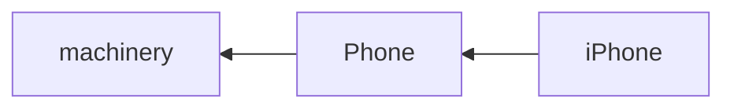

# 상속

### 📌 이전 시간 코드 리뷰

- 객체 지향에서 생성자 유효성 검사를 진행할때는 setter만 쓸 수 있지만,  
  추후 아키텍쳐를 공부하게 되면 다른 방법들이 역할을 나누어 가지게 될거라서 안쓰게 된다


- init으로 객체 생성 시점의 유효성 검사와, setter로 값 변경 시점의 유효성 검사는 따로다
  - 안정성을 위해서 함수로 만들어서 둘 다에 적용하는 것이 휴먼 에러를 줄이는데 효과적이다


- 컴퓨터에서 소수점을 정확히 표현하지 못하는 이유?
  - 부동 소수점 floating point
  - 테스트 코드 빡세게 작성해야 한다
  - 엡실론 Ⲉ : 부동 소수점의 오차를 나타냄  
    아주 작은 엡실론 값 (ex. 10^-9)와 같은 값을 정의하여 해당 값 범위의 오차는 무시하도록 테스트  
      ```kotlin
      assertEquals(power, wand.power, 1e-9)
      ```  
    코틀린에서는 `assertEquals` 에서 Double 값을 테스트할 때 3번째 인자에 델타 값을 받아서 오차 범위로 사용


- 테스트 용이성을 위해서…
  - `random` 객체나 `LocalDate.now()` 같은 객체를 생성자 파라미터로 받아서 테스트하기 편하게 할 수 있다

---

## 상속 Inheritance

> ≓ 계승; superClass의 모든 것을 suvClass가 이어 받는다  
is-a 원칙을 만족해야 올바른 상속 — SOLID 원칙

#### 상속이 필요한 이유?
- 비슷하지만 일부 다른 클래스를 만들때, 복붙을 한다면…
    - 추가, 수정에 시간이 걸림
    - 소스의 파악이나 관리가 어려워짐

### Kotlin의 상속 문법
```kotlin
open class Hero(
    var name: String,
    var hp: Int = MAX_HP,
){}
```

- Kotlin에서 모든 클래스는 기본적으로 상속이 금지되어 있음
  - `open` 키워드를 앞에 붙여줘야 다른 클래스에서 상속이 가능함

```kotlin
class SuperHero(
    name: String,
    hp: Int = MAX_HP,
    var sword: Sword?,
) : Hero(name, hp) {}
```

- sub class에서 super class의 생성자 호출이 필수임
  - super class에서 선언된 프로퍼티를 sub class의 생성자로 받고 싶을 때,  
  `val` 이나 `var` 을 사용할 수 없다  
  ∵ 이미 존재하는 프로퍼티와 같은 이름의 프로퍼티를 생성할 수는 없기 때문에


- 왜 sub class보다 super class의 생성자가 먼저 호출될까?
  - 객체 지향에서 상속이란, 원래 있던 것을 물려받는 것이기 때문에 super class가 먼저 존재해야함
  - 구현도 그런식으로 되어있음
  - ∴ super class의 생성자가 호출되지 않으면 에러가 난다

```kotlin
override fun attack(slime: Slime) {
    super.attack(slime)

    if (isFlying) {
        println("$name 이 $slime 을 공격했다")
        slime.hp -= FLYING_DAMAGE
        println("$FLYING_DAMAGE 포인트의 추가 피해를 입혔다")
    }
}
```
- `super` 키워드: sub class에서 super class를 가리키는 키워드

#### is-a 원칙

> supClass is a superClass (서브 클래스는 슈퍼 클래스이다)  

- is-a 원칙을 준수해야 하는 이유 (SOLID 원칙을 왜 준수해야 할까?)
  - 객체 지향은 개발자가 현실세계처럼 이해하자고 나온 것
  - 잘못된 상속을 하면, 클래스를 확장할 때 현실세계와 모순이 생긴다  
    ⇒ 만족하지 못하면, 다형성을 사용하지 못함

- SOLID 원칙:
  - ㅇㄹ


- 자식 클래스 일수록 구체화되고, 부모 클래스일수록 추상적인 것으로 일반화된다

## UML



