# 인스턴스와 클래스
1. [객체 지향 프로그래밍](#객체-지향-프로그래밍)
2. [클래스](#클래스)
3. [📌 테스트 코드](#-테스트-코드)


## 객체 지향 프로그래밍

- 객체 지향 프로그래밍이 왜 좋은가?
  - 인간이 이해하기 쉬우라고 — 익숙하면 실수를 덜 하니까
  - 절차 지향 프로그래밍은 함수 안에 모든 행위가 일어나므로,  
  흐름을 놓칠 수 있어서 전체 코드를 이해하기 어려움


- 객체 *Object* : 현실 세계의 모든 객체
- 클래스 *Class* : 오브젝트를 가상세계용으로 구체화한 것
- 인스턴스 *Instance* : 클래스를 활용해 메모리상에 만들어낸 것


- Kotlin에서 변수 선언시 초기화가 필수인 이유:
    - null 값이 들어가려면 명시해 줘야하기 때문

---

## 클래스

- 클래스를 정의하는 것의 의미:
  - 인스턴스 생성
  - 해당 클래스를 새로운 변수 타입으로 사용 가능


- 네이밍 컨벤션
  - 클래스: 파스칼 케이스 (첫문자 대문자)
  - 필드, 메서드: 카멜 케이스 (첫문자 소문자)

### 생성자

```kotlin
fun main() {
    val hero = Hero()    // 기본 생성자
    val hero2 = Hero("홍길동", 10)
}

```

- 기본 생성자
    - 생성자가 지정되어 있지 않은 클래스에 기본으로 존재
    - 생성자를 지정하면서도 사용하고 싶다면, 디폴트값을 지정해줘야 함
- 생성자 문법이 클래스 선언부에 붙어있음

### 함수와 메서드

- **함수 *function* :** input이 같으면 output이 같음
- **메서드 *method* :** 클래스에 존재하는 기능
  - 필드를 가지고 동작할 수 있음
  ➡️ 필드가 input이 아닌 경우가 있으므로, 필드 값에 따라서 output이 달라질 수 있음
  - 즉, input이 아닌 필드에 따라 output이 달라질 수 있으므로 순수함수가 아닐 수 있음

---

## 📌 테스트 코드

[Test code using JUnit in JVM – tutorial | Kotlin](https://kotlinlang.org/docs/jvm-test-using-junit.html#create-a-test)

> `kotlin.test` 라이브러리를 사용하고 JUnit을 사용하여 테스트를 실행


### 종속성 추가 (JUnit 4)

```kotlin
// build.gradle.kts (Kotlin)

// 의존성
dependencies {
    testImplementation(kotlin("test"))
    testImplementation("junit:junit:4.13.1")
}

// 테스트 러너
tasks.test {
    useJUnit()
// useJUnitPlatform()은 JUnit 5 (Jupiter) 전용 러너
}
```

### 테스트 코드 작성

- `@Test` 어노테이션을 사용하여 함수 정의
- `assertEquals(expected, actual)` 함수를 통해 예상한 값과 실제 값이 일치하는지 확인

```kotlin
class HeroTest {
    @Test
    fun `Hero의 attack() 메서드를 실행하면 hp가 10만큼 줄어든다`(){
        // given (준비)
        val hero = Hero(hp = 100)

        // when (실행)
        hero.attack()

        // then (검증)
        assertEquals(90, hero.hp)
    }
}
```

### 단위 테스트(Unit Test)의 구조

> Behavior-Driven Development (BDD) 스타일에서 유래됨

- Given: 테스트 대상 객체나 입력 데이터를 준비하는 단계
  - 외부 상태 변경 없이 테스트 전제 조건을 설정
  - Mock, Stub, Fake
- When: 테스트 대상 코드를 실행하는 단계
  - 테스트 대상 메서드나 함수 호출이 이루어짐
  - 한 테스트 함수에 한 번만 있어야 함
- Then: 실행 결과를 검증하는 단계
  - 예상 결과와 실제 결과를 비교
  - 다르면 테스트 실패

```mermaid
graph LR
  A[given<br>준비]
  B[when<br>실행]
  C[then<br>검증]
  A --> B --> C
```



#### `assert` 계열 함수

[kotlin.test](https://kotlinlang.org/api/core/kotlin-test/kotlin.test/) > 
Package-level declarations > Functions

| 함수명 | 설명 | 예시 |
| --- | --- | --- |
| `assertEquals(expected, actual)` | 두 값이 같은지 비교 | `assertEquals(5, add(2, 3))` |
| `assertNotEquals(unexpected, actual)` | 두 값이 다르면 성공 | `assertNotEquals(0, result)` |
| `assertTrue(condition)` | 조건이 `true`면 성공 | `assertTrue(list.isEmpty())` |
| `assertFalse(condition)` | 조건이 `false`면 성공 | `assertFalse(value < 0)` |
| `assertNull(value)` | 값이 `null`이면 성공 | `assertNull(user.name)` |
| `assertNotNull(value)` | 값이 `null`이 아니면 성공 | `assertNotNull(response)` |
| `assertSame(expected, actual)` | 같은 객체 참조인지 비교 (`===`) | `assertSame(obj1, obj2)` |
| `assertNotSame(unexpected, actual)` | 다른 객체 참조인지 비교 | `assertNotSame(a, b)` |
| `fail(message)` | 테스트를 강제로 실패시킴 | `fail("예외가 발생해야 함")` |

- JUnit 4에서는 대부분의 assert 함수가 아래 패키지에 포함됨
```kotlin
import org.junit.Assert.*
```

