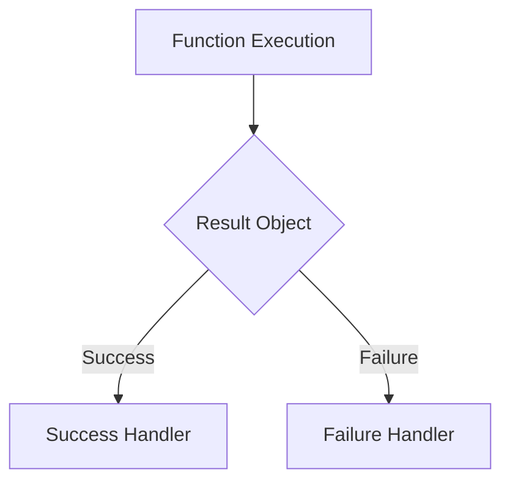

# Result 패턴
Result 패턴은 성공, 실패 시 처리에 유용한 패턴이다.



## Result 패턴 예시 1
Result 클래스는 성공 시에는 데이터를, 실패 시에는 에러 정보(`Exception`, `String`)를 담는 객체를 정의한다.

```kotlin
sealed class Result<out D> {
    data class Success<out D>(val data: D) : Result<D>()
    data class Error(val e: Throwable) : Result<Nothing>()
}
```

## Result 패턴 효과
- `enum`과 동일하게 `when`과 조합하여 모든 처리를 강제할 수 있다
- 성공과 실패를 처리할 수 있다

```kotlin
val result = repository.getTodo(1)

when (result) {
    is Result.Success -> TODO()
    is Result.Error -> TODO()
}
```

## Result 패턴 예시 2

```kotlin
sealed class Result<out D, out E> {
    data class Success<out D>(val data: D) : Result<D, Nothing>()
    data class Error(val error: E) : Result<Nothing, E>()
}
```

- Repository에서 사용 예

```kotlin
sealed class NetworkError {
    object NoConnection : NetworkError()
    object RequestTimeout : NetworkError()
    object UNKNOWN : NetworkError()
}

suspend fun getTodos(): Result<List<Todo>, NetworkError> {
    try {
        return Result.Success(dataSource.getTodos()
            .filter { it.id != null }
            .map { it.toModel() })
    } catch (e: TimeoutException) {
        return Result.Error(NetworkError.REQUEST_TIME_OUT)
    } catch (e: Exception) {
        return Result.Error(NetworkError.UNKNOWN)
    }
}
```

## 정리
- Result 패턴은 성공과 실패를 명확하게 처리
- `sealed class`는 서브타입을 봉인
- `sealed class`는 패턴매칭을 활용하여 모든 서브타입에 대한 처리를 하기 용이
- 예외 `throw` 없이 값으로 에러를 처리하며, 명확한 타입 구분을 지원
- Result 패턴은 `when`을 활용하여 모든 성공과 실패의 처리를 강제
