# 설계 원칙
## 응집도 (Cohesion) & 결합도(Coupling)
응집도를 높이고 결합도를 낮추라는 얘기를 굉장히 많이 들었었다.

### 응집도
- 모듈이 하나의 목적을 수행하는 요소들간의 연관성 척도
- 모듈 내부의 기능적인 응집 정도를 나타냄
- 높은 응집도: 모듈이 하나의 특정 작업이나 기능에 집중
  - ex: `UserAutehntication` 클래스 - 로그인, 로그아웃, 비밀번호 변경 기능
- 낮은 응집도: 모듈이 여러 가지 서로 관련 없는 작업을 수행
  - ex: `Util` 클래스 - 문자열 처리, 파일 읽기, 날짜 계산 기능

### 결합도
- 모듈이 다른 모듈에 의존하는 정도의 척도
- 모듈과 모듈간의 상호 결합 정도를 나타냄
- 낮은 결합도: 모듈이 서로 독립적으로 작동할 수 있을 때
  - ex: `UserAutehntication` 클래스가 특정 클래스가 아니라 인터페이스를 통해 사용자 정보를 가져오는 경우
- 높은 결합도: 모듈이 서로 강하게 연결되어 있을 때
  - ex: `UserAutehntication` 클래스가 특정 클래스의 내부 구현에 직접 의존하는 경우

## SOLID 원칙
객체지향 5가지 원칙으로 SOLID로 줄여서 얘기한다.
- SRP: 단일 책임 원칙(Single Responsibility Principle)
- OCP: 개방 폐쇄 원칙(Open Closed Principle)
- LSP: 리스코프 치환 원칙(Liskov substitution Principle)
- ISP: 인터페이스 분리 원칙(Interface Segregation Principle)
- DIP: 의존관계 역전 원칙(Dependency Inversion Principle)

# 디자인 패턴
소프트웨어 디자인 패턴은 특정 문맥에서 공통적으로 발생하는 문제에 대해 재사용 가능한 해결책이다.
디자인 패턴은 굉장히 많다. 전체 사용은 하지 않고 많이 사용되는게 있고, 필요한 상황에 맞춰서 쓰면 된다.

디자인 패턴 참고 자료 링크  
[디자인 패턴](https://refactoring.guru/ko/design-patterns)

## 아키텍처 디자인 패턴
Spring의 경우 `MVC`(Model, View, Controller)를 많이 사용한다.   
앱의 경우 최근에 `MVVM`을 많이 사용한다고 알고 있다.

### MVVM 기반의 클릭 아키텍처 구조

```mermaid
graph TD
    A[UI Layer] --> B[Domain Layer]
    B --> C[Data Layer]
    C --> D[Repositories]
    C --> E[Data Sources]

    style A fill:#f0f0f0
    style B fill:#f0f0f0
    style C fill:#1e2a4e, stroke:#f0f0f0
    style D fill:#d2f7c1
    style E fill:#a7cfff
```

